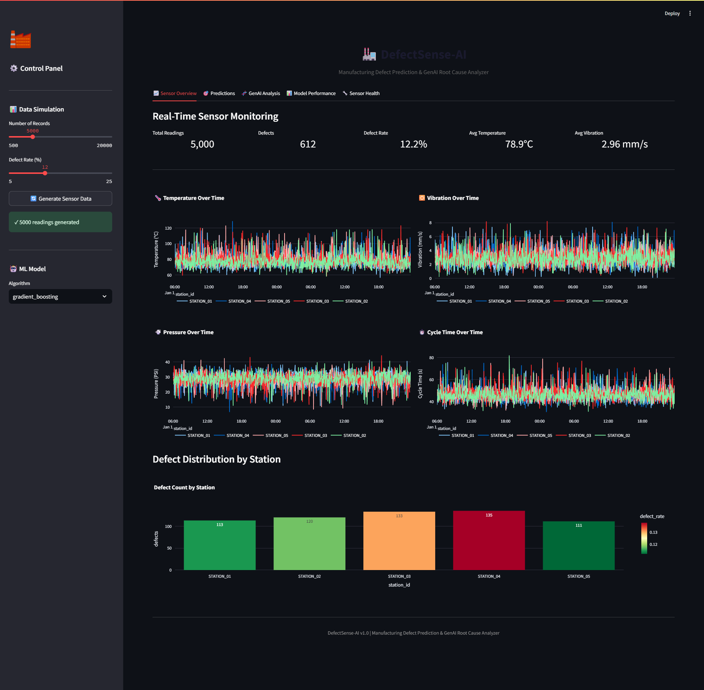
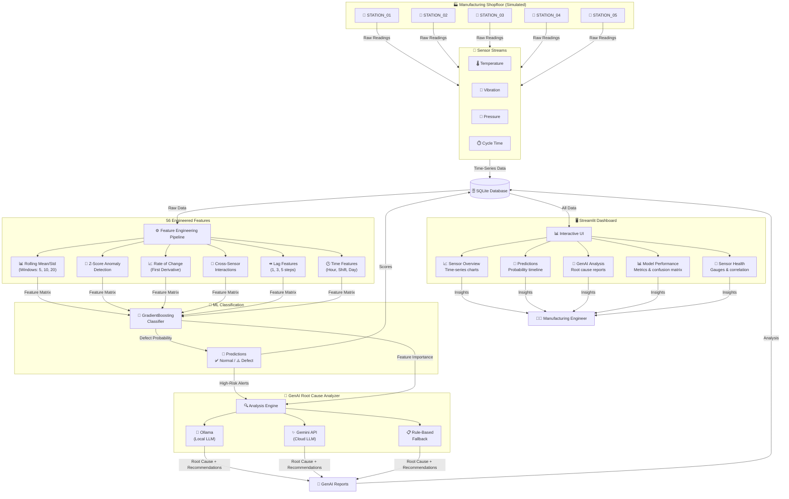
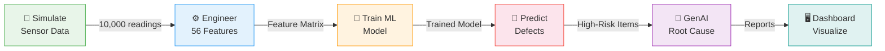
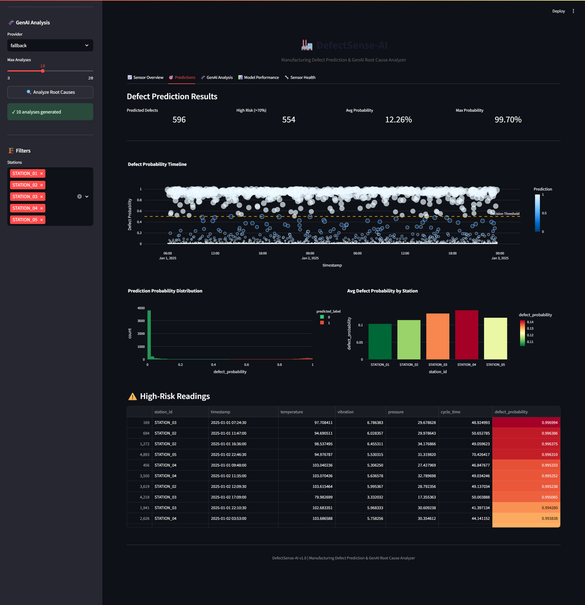
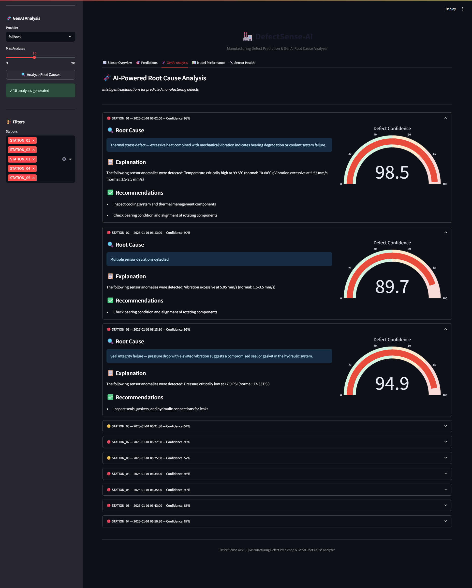
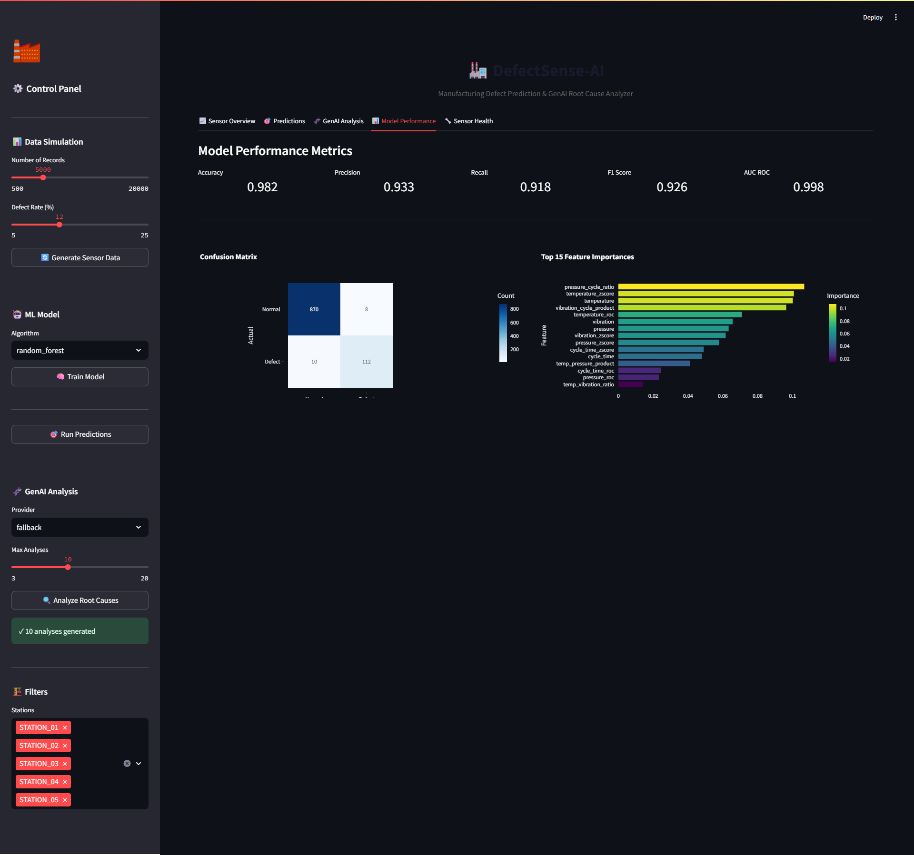
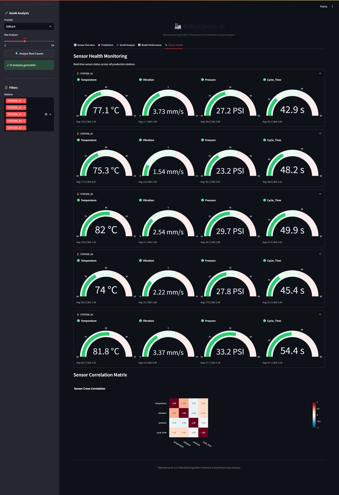

<h1><span style="color:white">🏭 DefectSense-AI</span></h1>

### Manufacturing Defect Prediction & GenAI Root Cause Analyzer

> A full-stack machine learning system that predicts manufacturing defects from real-time sensor data and uses Generative AI to explain root causes in plain English — all wrapped in an interactive industrial dashboard.


<p align="center">
  
  <br/>
  <em>DefectSense-AI Dashboard — Sensor Overview</em>
</p>
---

## 📋 Table of Contents

- [What is DefectSense-AI?](#-what-is-defectsense-ai)
- [Why This Project?](#-why-this-project)
- [System Architecture](#-system-architecture)
- [How It Works — Step by Step](#-how-it-works--step-by-step)
- [Project Structure](#-project-structure)
- [Features](#-features)
- [Tech Stack](#-tech-stack)
- [Getting Started](#-getting-started)
- [Usage Guide](#-usage-guide)
- [Dashboard Walkthrough](#-dashboard-walkthrough)
- [Model Performance](#-model-performance)
- [GenAI Integration](#-genai-integration)
- [Configuration](#-configuration)
- [Testing](#-testing)
- [Future Enhancements](#-future-enhancements)
- [License](#-license)

---

## 🤔 What is DefectSense-AI?

**DefectSense-AI** simulates a smart manufacturing shopfloor where sensors on production stations continuously monitor critical parameters. It answers two key questions:

1. **"Will this part be defective?"** → A trained ML model predicts defects *before* they happen
2. **"Why is it defective?"** → A GenAI layer explains the root cause in plain language

Think of it as giving a manufacturing engineer a **crystal ball** that not only warns about problems but also explains *why* they're happening and *what to do about it*.

### The Problem It Solves

In traditional manufacturing:
```
Defect happens → Inspector catches it → Engineer investigates → Hours/days lost
```

With DefectSense-AI:
```
Sensors detect patterns → ML predicts defect → GenAI explains why → Engineer prevents it
```

---

## 💡 Why This Project?

| Challenge | How DefectSense-AI Addresses It |
|-----------|-------------------------------|
| Reactive quality control | Shifts to **predictive** — catch defects before they occur |
| Complex sensor data | **Feature engineering** transforms raw signals into actionable indicators |
| "Black box" ML predictions | **GenAI explains** predictions in language engineers understand |
| Expensive BI tools | **Free, open-source** Streamlit dashboard with industrial-grade visuals |
| Cloud dependency | **Runs entirely locally** — SQLite + Ollama, no cloud needed |

---

## 🏗 System Architecture



### Data Flow Summary



---

## ⚙ How It Works — Step by Step

### Step 1: Sensor Data Simulation

The system simulates **5 production stations**, each generating readings for 4 sensors:

| Sensor | Normal Range | What It Measures |
|--------|-------------|------------------|
| 🌡️ Temperature | 70–80°C | Heat at the production point |
| 📳 Vibration | 1.5–3.5 mm/s | Mechanical oscillation |
| 💨 Pressure | 27–33 PSI | Hydraulic/pneumatic pressure |
| ⏱️ Cycle Time | 41–49 seconds | Time to complete one production cycle |

**Defects are injected** using 4 realistic failure patterns:

```
Thermal Defect      → Temperature ↑↑ + Vibration ↑↑     (35% of defects)
Seal Failure        → Pressure ↓↓ + Vibration ↑         (25% of defects)
Mechanical Wear     → Cycle Time ↑↑ + Vibration ↑       (25% of defects)
Electrical Anomaly  → Temperature ↑↑↑ + Pressure swing   (15% of defects)
```

### Step 2: Feature Engineering

Raw sensor readings are transformed into **56 meaningful features**:

```
Raw Data (4 sensors)
    │
    ├── Rolling Statistics (windows: 5, 10, 20)
    │   ├── rolling_mean  → Smoothed trends
    │   └── rolling_std   → Variability over time
    │
    ├── Anomaly Indicators
    │   └── z_scores      → How far from normal?
    │
    ├── Rate of Change
    │   └── first_diff    → How fast is it changing?
    │
    ├── Cross-Sensor Interactions
    │   ├── temp × vibration    → Thermal-mechanical coupling
    │   ├── pressure / cycle    → Efficiency ratio
    │   └── temp × pressure     → Thermodynamic indicator
    │
    ├── Lag Features (1, 3, 5 steps back)
    │   └── What were the values recently?
    │
    └── Time Features
        ├── hour, day_of_week
        └── is_night_shift     → Shift-based patterns
```

### Step 3: ML Model Training

A **Gradient Boosting Classifier** learns to distinguish normal vs. defective readings:

```
Training Process:
━━━━━━━━━━━━━━━━━━━━━━━━━━━━━━━━━━━━━━━━━━━━━━━━━
  Data Split      →  80% Training / 20% Testing (stratified)
  Scaling         →  StandardScaler normalization
  Algorithm       →  GradientBoostingClassifier (200 trees, depth 5)
  Validation      →  5-fold cross-validation
  Output          →  Saved model (.pkl) + metrics + feature importance
━━━━━━━━━━━━━━━━━━━━━━━━━━━━━━━━━━━━━━━━━━━━━━━━━
```

### Step 4: Defect Prediction

The trained model scores every sensor reading:

```
Input:  [temperature=98.5, vibration=6.2, pressure=28.1, cycle_time=52.3, ...56 features]
                                    │
                              Model Scoring
                                    │
                                    ▼
Output: defect_probability = 0.92  →  DEFECT (High Risk ⚠️)
```

### Step 5: GenAI Root Cause Analysis

For every predicted defect, the GenAI layer generates a human-readable explanation:

```
┌────────────────────────────────────────────────────────────┐
│  Input to GenAI:                                           │
│  • Sensor values (what happened)                           │
│  • Feature importances (what mattered most)                │
│  • Prediction confidence (how sure is the model)           │
│                                                            │
│  Output from GenAI:                                        │
│  🔍 Root Cause: "Thermal stress defect — excessive heat    │
│     combined with vibration indicates bearing degradation"  │
│  📋 Explanation: "Temperature at 98.5°C is 23% above       │
│     normal range. Vibration at 6.2 mm/s is 77% elevated."  │
│  ✅ Actions: "1. Inspect cooling system                    │
│              2. Check bearing alignment                    │
│              3. Schedule preventive maintenance"           │
└────────────────────────────────────────────────────────────┘
```

---

## 📁 Project Structure

```
Defectsense-Ai/
│
├── app.py                      # Streamlit dashboard (5 tabs, interactive UI)
├── config.py                   # Central configuration (sensors, ML, GenAI)
├── run_pipeline.py             # End-to-end CLI pipeline runner
├── requirements.txt            # Python dependencies
│
├── src/                        # Core modules
│   ├── __init__.py
│   ├── data_simulator.py       # Sensor data generation with defect injection
│   ├── feature_engineering.py  # 56-feature extraction pipeline
│   ├── model_training.py       # ML model training & evaluation
│   ├── model_inference.py      # Batch prediction & high-risk filtering
│   ├── genai_analyzer.py       # GenAI root cause analysis (Ollama/Gemini)
│   └── database.py             # SQLite schema & CRUD operations
│
├── models/                     # Trained model artifacts
│   └── defect_model.pkl        # Serialized model + scaler + metadata
│
├── data/                       # Database storage
│   └── defectsense.db          # SQLite database (auto-generated)
│
└── tests/                      # Unit test suite (30 tests)
    ├── test_simulator.py       # Data generation tests
    ├── test_features.py        # Feature engineering tests
    ├── test_model.py           # ML model accuracy & inference tests
    └── test_genai.py           # GenAI response structure & logic tests
```

---

## ✨ Features

### Predictive Analytics
- Real-time defect prediction with probability scores
- High-risk reading identification and alerting
- Station-level defect rate tracking

### Intelligent Explanations
- GenAI-powered root cause analysis in plain English
- Contextualized recommendations for maintenance actions
- Support for local (Ollama) and cloud (Gemini) LLMs
- Robust rule-based fallback when no LLM is available

### Interactive Dashboard
- **Sensor Overview** — Live time-series charts for all 4 sensors across stations
- **Predictions** — Defect probability timeline, distribution histograms, high-risk table
- **GenAI Analysis** — Expandable root cause reports with confidence gauges
- **Model Performance** — Confusion matrix, feature importance, accuracy metrics
- **Sensor Health** — Per-station gauge indicators with anomaly highlighting

### Engineering Best Practices
- Modular architecture with clear separation of concerns
- SQLite persistence with no infrastructure overhead
- Comprehensive test suite (30 tests covering all modules)
- Configurable via single `config.py` file

---

## 🛠 Tech Stack

| Category | Technology | Purpose |
|----------|-----------|---------|
| **Language** | Python 3.11+ | Core development |
| **ML Framework** | scikit-learn | Model training, evaluation, inference |
| **Data Processing** | pandas, NumPy | Feature engineering, data manipulation |
| **Dashboard** | Streamlit | Interactive web UI |
| **Visualization** | Plotly | Charts, gauges, heatmaps |
| **Database** | SQLite | Lightweight data persistence |
| **GenAI (Local)** | Ollama | Local LLM inference (llama3) |
| **GenAI (Cloud)** | Google Gemini | Cloud LLM fallback |
| **Serialization** | joblib | Model artifact storage |
| **Testing** | pytest | Unit test framework |

---

## 🚀 Getting Started

### Prerequisites

- **Python 3.11+** installed
- (Optional) **Ollama** for local LLM — [Install Ollama](https://ollama.ai)
- (Optional) **Google Gemini API Key** — [Get API Key](https://makersuite.google.com/app/apikey)

### Installation

```bash
# 1. Clone the repository
git clone https://github.com/yourusername/Defectsense-Ai.git
cd Defectsense-Ai

# 2. Install dependencies
pip install -r requirements.txt

# 3. (Optional) Set up Gemini API key
# Windows:
set GEMINI_API_KEY=your_api_key_here

# Linux/Mac:
export GEMINI_API_KEY=your_api_key_here

# 4. (Optional) Set up Ollama for local LLM
ollama serve          # Start Ollama server
ollama pull llama3    # Download model
```

### Quick Start

**Option A — Dashboard (Recommended):**
```bash
streamlit run app.py
```
Then open http://localhost:8501 in your browser.

**Option B — CLI Pipeline:**
```bash
python run_pipeline.py --records 5000 --provider fallback --analyses 10
```

---

## 📖 Usage Guide

### Running the Dashboard

```bash
streamlit run app.py
```

**Step-by-step workflow in the dashboard:**

```
1. Click "Generate Sensor Data"     → Simulates manufacturing readings
       ↓
2. Click "Train Model"             → Trains the ML classifier (~1-2 min)
       ↓
3. Click "Run Predictions"         → Scores all readings for defects
       ↓
4. Select GenAI Provider           → Choose "gemini", "ollama", or "fallback"
       ↓
5. Click "Analyze Root Causes"     → Generates AI explanations for defects
```

### Running the CLI Pipeline

```bash
# Default run (5000 records, rule-based analysis)
python run_pipeline.py

# Custom run
python run_pipeline.py --records 10000 --provider gemini --analyses 20 --seed 123

# Available arguments:
#   --records    Number of sensor records to simulate (default: 5000)
#   --provider   GenAI provider: ollama, gemini, or fallback (default: fallback)
#   --analyses   Maximum number of root cause analyses (default: 10)
#   --seed       Random seed for reproducibility (default: 42)
```

### Using Individual Modules

```python
# Generate sensor data
from src.data_simulator import generate_sensor_data
df = generate_sensor_data(num_records=1000, seed=42)

# Engineer features
from src.feature_engineering import engineer_features
featured_df = engineer_features(df)

# Train a model
from src.model_training import train_model
artifact = train_model(df)

# Make predictions
from src.model_inference import predict_batch
results = predict_batch(df, artifact)

# Analyze a defect
from src.genai_analyzer import analyze_defect
report = analyze_defect(
    sensor_data={"temperature": 105, "vibration": 7, "pressure": 25, "cycle_time": 55,
                 "station_id": "STATION_01", "timestamp": "2025-01-15 08:30:00"},
    prediction_info={"defect_probability": 0.92, "predicted_label": 1},
    provider="gemini"  # or "ollama" or "fallback"
)
print(report["root_cause"])
print(report["recommendations"])
```

---

## 📊 Dashboard Walkthrough

### Tab 1: Sensor Overview
Real-time monitoring of all sensor streams across production stations.
- **KPI cards** — Total readings, defect count, defect rate, averages
- **Time-series charts** — Temperature, vibration, pressure, cycle time trends
- **Defect distribution** — Bar chart showing defects per station with color-coded rates

<p align="center">
  
</p>

### Tab 2: Predictions
Visual analysis of the ML model's defect predictions.
- **Prediction timeline** — Scatter plot of defect probabilities over time
- **Probability histogram** — Distribution of prediction confidence scores
- **Station comparison** — Average defect probability per station
- **High-risk table** — Sortable list of readings above the risk threshold

<p align="center">
  
</p>

### Tab 3: GenAI Analysis
AI-generated root cause reports for flagged defects.
- **Expandable report cards** — Each defect gets its own detailed analysis
- **Severity indicators** — Color-coded by confidence (red/orange/yellow)
- **Confidence gauge** — Visual indicator of prediction certainty
- **Structured output** — Root cause, explanation, and actionable recommendations

<p align="center">
  
</p>

### Tab 4: Model Performance
Transparency into how the ML model performs.
- **Metrics dashboard** — Accuracy, precision, recall, F1-score, AUC-ROC
- **Confusion matrix** — Visual breakdown of true/false positives/negatives
- **Feature importance** — Top 15 features driving predictions
- **Cross-validation score** — Model stability across data folds

<p align="center">
  
</p>

### Tab 5: Sensor Health
Per-station health monitoring with gauge visualizations.
- **Station gauges** — Real-time gauge indicators for each sensor per station
- **Status indicators** — Green (normal) / Red (anomalous) status flags
- **Statistical summary** — Mean and standard deviation per sensor
- **Correlation matrix** — Heatmap showing cross-sensor relationships

<p align="center">
  
</p>

---

## 📈 Model Performance

Results from training on 5,000 simulated sensor readings:

| Metric | Score |
|--------|-------|
| **Accuracy** | 98.4% |
| **Precision** | 94.9% |
| **Recall** | 91.8% |
| **F1-Score** | 0.933 |
| **AUC-ROC** | 0.998 |
| **Cross-Val F1** | 0.936 ± 0.017 |

**Top 5 Most Important Features:**
1. `vibration_cycle_product` — Interaction between vibration and cycle time
2. `pressure_cycle_ratio` — Pressure efficiency indicator
3. `temperature_zscore` — Temperature anomaly score
4. `temperature` — Raw temperature reading
5. `pressure` — Raw pressure reading

---

## 🧬 GenAI Integration

DefectSense-AI supports **3 GenAI providers** for root cause analysis:

### 1. Ollama (Local LLM) — Recommended for Privacy
```bash
# Setup
ollama serve
ollama pull llama3

# In config.py or dashboard sidebar:
GENAI_PROVIDER = "ollama"
```
- Runs entirely on your machine
- No data leaves your network
- Requires ~4GB RAM for llama3

### 2. Google Gemini API — Best Quality
```bash
# Set API key
set GEMINI_API_KEY=your_key_here   # Windows
export GEMINI_API_KEY=your_key_here # Linux/Mac

# In config.py or dashboard sidebar:
GENAI_PROVIDER = "gemini"
```
- Uses Gemini 2.0 Flash model
- Higher quality responses
- Requires internet connection

### 3. Rule-Based Fallback — Always Available
```python
# No setup needed — works automatically
GENAI_PROVIDER = "fallback"
```
- Pattern-matching logic for 4 defect types
- No LLM or API required
- Instant responses
- Used automatically if Ollama/Gemini are unavailable

### Sample GenAI Output

```
🔍 Root Cause:
   Thermal stress defect — excessive heat combined with mechanical
   vibration indicates bearing degradation or coolant system failure.

📋 Explanation:
   Temperature critically high at 102.5°C (normal: 70-80°C).
   Vibration excessive at 6.80 mm/s (normal: 1.5-3.5 mm/s).
   These patterns strongly correlate with thermal-mechanical stress
   in the station's rotating components.

✅ Recommendations:
   1. Inspect cooling system and thermal management components
   2. Check bearing condition and alignment of rotating components
   3. Schedule preventive replacement of wear-prone parts
```

---

## ⚙ Configuration

All settings are centralized in `config.py`:

```python
# Simulation
NUM_STATIONS = 5            # Number of production stations
NUM_RECORDS = 10000         # Default sensor readings to generate
DEFECT_RATE = 0.12          # ~12% defect injection rate

# Sensor baselines (normal operating conditions)
SENSOR_BASELINES = {
    "temperature": {"mean": 75.0, "std": 5.0},
    "vibration":   {"mean": 2.5,  "std": 0.8},
    "pressure":    {"mean": 30.0, "std": 3.0},
    "cycle_time":  {"mean": 45.0, "std": 4.0},
}

# Feature engineering
ROLLING_WINDOWS = [5, 10, 20]  # Window sizes for rolling statistics

# ML Model
TEST_SIZE = 0.2              # 80/20 train-test split
MODEL_TYPE = "gradient_boosting"  # or "random_forest"

# GenAI
GENAI_PROVIDER = "gemini"    # "ollama", "gemini", or "fallback"
OLLAMA_MODEL = "llama3"      # Ollama model name
```

---

## 🧪 Testing

The project includes **30 unit tests** covering all modules:

```bash
# Run all tests
python -m pytest tests/ -v

# Run specific test file
python -m pytest tests/test_model.py -v

# Run with coverage (if pytest-cov installed)
python -m pytest tests/ --cov=src --cov-report=term-missing
```

### Test Coverage

| Module | Tests | What's Tested |
|--------|-------|---------------|
| `test_simulator.py` | 6 | Output shape, station distribution, defect rate, reproducibility, no negative values |
| `test_features.py` | 8 | Feature count, no NaN values, rolling/zscore/cross-sensor features, column preservation |
| `test_model.py` | 10 | Accuracy >85%, F1 >70%, AUC >85%, probability range, feature importance, inference correctness |
| `test_genai.py` | 6 | Thermal/seal/wear detection, response structure, prompt content, actionable recommendations |

---

## 🔮 Future Enhancements

- [ ] **Real sensor integration** — Connect to OPC-UA/MQTT for live industrial data
- [ ] **Anomaly detection** — Unsupervised models (Isolation Forest, Autoencoders) for novel defect discovery
- [ ] **Multi-model ensemble** — Combine GradientBoosting + RandomForest + XGBoost for better accuracy
- [ ] **Time-series forecasting** — Predict sensor trends with LSTM/Prophet
- [ ] **Alert system** — Email/SMS notifications when defect probability exceeds thresholds
- [ ] **Model retraining pipeline** — Automated retraining on new data with MLflow tracking
- [ ] **Docker deployment** — Containerized version for production environments
- [ ] **REST API** — FastAPI endpoint for integration with MES/ERP systems

---

## 📄 License

This project is open source and available under the [MIT License](LICENSE).

---

<div align="center">

**Built with ❤️ for smarter manufacturing**

*DefectSense-AI — Because every defect has a story, and AI can tell it.*

</div>
